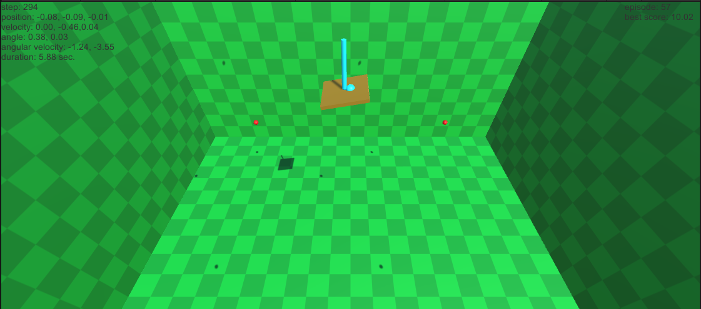

# ニューラルネットワークによる3次元倒立振子の制御

## 概要

倒立振子の制御は, 台車を適切に動かすことで, 台車の上に立てた棒を倒さないようにするタスクであり, 制御アルゴリズムのベンチマークとして広く用いられている.
本プログラムでは, ニューラルネットワークの入力を倒立振子の状態, 出力を台車に加える力とし, 誤差逆伝播法により学習させることで, 3次元倒立振子の制御を行う.

なお, Unityのバージョンは`2021.2.1f1`で作成した.
他のバージョンでは動作確認していない.

## 教師データの生成

誤差逆伝播法によりニューラルネットワークの学習を行うためには, 手本となる出力である教師データが必要となる.
本プログラムでは, 実際にとった行動と, その行動の結果得られた台車の状態から, 本来とるべきだった行動(教師データ)を生成する. 教師データの生成には, 以下の式が用いられている.

- x, z方向: 教師データ = 実際の行動 + k_1 \* 角度の誤差 + k_2 \* 位置の誤差
- y方向: 教師データ = 実際の行動 - k_2 \* 位置の誤差 - k_3 \* 速度の誤差

ここで, x, z方向とy方向とでは, 位置の誤差の項の符号が逆になっていることに注意する. y方向では, たとえば下にずれていた場合, 上向きに力を加える. それに対し, x, z方向では, たとえば右にずれていた場合, 右向きに力を加える. これは, まず右に力を加えると, 棒が左に傾き, その後傾きを修正するために左向きに力を加えることで, 棒を真っ直ぐに安定させつつ, 台車を左に移動させることができるためである.

## シーンの説明

Stage1, Stage2の2つのシーンが用意されている.

### Stage1

3次元空間上を自由に動く台車に力を加え, 台車を所定の範囲内で移動させることで, 棒を倒さないようにするタスクを行う.

各エピソードは,

1. 所定のステップ数が経過した
2. 台車が所定の範囲の外に出た
3. 台車が所定の角度以上に傾いた

のいずれかの条件をみたしたとき終了となる.

画面の左上には,

- エピソード開始からのステップ数
- 台車の位置
- 台車の速度
- 棒の角度
- 棒の角速度
- スコア(エピソード開始からの時間)

が表示される.

画面の右上には,

- 何番目のエピソードか
- 全エピソードの最良スコア

が表示される.

### Stage2

基本的にはStage1と同じだが, 小球を生成, 発射する機能が追加されている.
画面上をクリックすると, 視点の位置に小球が生成され, クリックした位置に向かって発射される.
台車の付近をクリックすることで, 小球を台車に衝突させ, 台車の外乱特性を調べることができる.

実際に小球を台車に衝突させると, 小球が下の板の部分に衝突した場合には, 棒を立てたまま保つことができることが多い.
しかし, 棒の部分に衝突した場合には, たいていは棒が倒れてしまう.

## スクリプトの説明

プロジェクトを構成するスクリプトについて簡単に説明する.

- `Agent.cs`: 抽象的なAgentクラス. Agentの状態の取得や, Agentの行動を行う. 主に継承して用いる.
- `NNBrain.cs`: 抽象的なニューラルネットワークのBrainクラス. 状態を入力すると, 行動が出力される. 主に継承して用いる.
- `NNEnvironment.cs`: ニューラルネットワークの環境クラス. さまざまなオブジェクトの管理, 更新を行う. おそらくこれを読むと, プログラムの全体的な流れを掴みやすい.
- `CartPoleAgent.cs`: Agentを継承したクラス. 環境の状態を観測し, CartControllerを通じて行動を行う.
- `CartController.cs`: CartPoleAgentから行動を受け取り, Cartオブジェクトに力を加える.
- `NNBrain3D.cs`: NNBrainを継承したクラス. 事前学習や, 教師データの生成が実装されている.
- `ScoreRecorder.cs`: スコアの保存を行うクラス. (エピソード数, エピソードのスコア, 全エピソードの最良スコア)の形式で, CSVファイルに保存する.
- `PositionRecorder3D.cs`: 位置の保存を行うクラス. (エピソード数, x座標, y座標, z座標)の形式で, CSVファイルに保存する.
- `BallGenerator.cs`: Stage2において, ボールの生成を行うクラス.
- `BallController.cs`: Stage2において, ボールの表示, 破壊を行うクラス.
- `NN.cs`: ニューラルネットワークを実装したクラス.
- `Matrix.cs`: 行列計算を実装したクラス. `NN.cs`で用いられている.
- `Const.cs`: 定数を定義したクラス.

## パラメータの説明

Unityの画面上では, ヒエラルキーウィンドウでオブジェクトを選択すると, インスペクターウィンドウを通じて, オブジェクトにアタッチされたスクリプトのパラメータを編集することができる.

- CartPoleオブジェクトを選択すると, `CartPoleAgent.cs`の次のパラメータを編集することができる.
  - `IsLearning`: 学習を行うか
  - `MaxDistance`: x, y, z座標の絶対値の上限
  - `MaxStartAngle`: 初期状態における棒の傾きの大きさの上限
  - `MaxStep`: ステップ数の上限

- CartPoleオブジェクトの子オブジェクトCartを選択すると, `CartController.cs`の次のパラメータを編集することができる.
  - `MaxForce`: 台車(下の板の部分)に加える力の大きさの上限

- Environmentオブジェクトを選択すると, `NNBrain3D.cs`の次のパラメータを編集することができる.
  - `HiddenSize`: NNの隠れ層のサイズ
  - `HiddenLayers`: NNの隠れ層の数
  - `LearningRate`: 学習率
  - `EnablePreTrain`: 事前学習を行うか
  - `PreTrainNum`: 事前学習を行う回数
  - `TrainParamK1`: 教師データの作成に用いるパラメータ(棒の角度情報の重み)
  - `TrainParamK2`: 教師データの作成に用いるパラメータ(台車の位置情報の重み)
  - `TrainParamK3`: 教師データの作成に用いるパラメータ(台車の速度情報の重み)

- ScoreRecorderオブジェクトを選択すると, `ScoreRecorder.cs`の次のパラメータを編集することができる.
  - `RecordScore`: スコアを保存するか
  - `ScoreDir`: スコアの保存先のディレクトリ

- PositionRecorderオブジェクトを選択すると, `PositionRecorder3D.cs`の次のパラメータを編集することができる.
  - `RecordPosition`: 台車の位置を保存するか
  - `PositionDir`: 台車の位置の保存先のディレクトリ

- Stage2に限り, MainCameraオブジェクトの子オブジェクトBallGeneratorを選択すると, `BallGenerator.cs`の次のパラメータを編集することができる.
  - `NormForce`: ボールに加える力の大きさ
